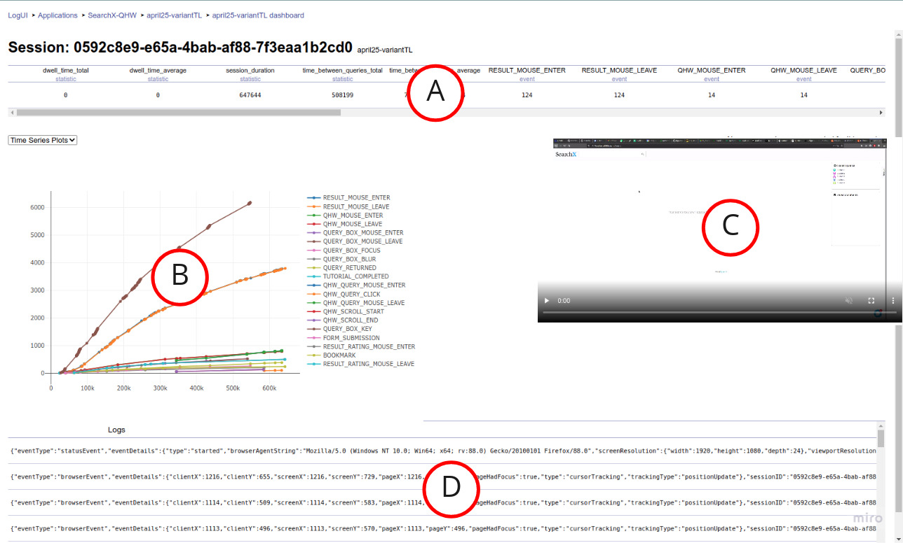

# LogUI Server Expansion <a href="https://www.tudelft.nl"></a>


**Welcome to this LogUI expansion!** 
This is an expansion of the [LogUI Server](https://github.com/logui-framework/server)This expansion adds two features to *LogUI*. Screen capture functionality is added to the logging process of LogUI as well as a dashboard for statistical analysis of logs.

This repository houses the LogUI expansion server component. It's a Dockerised, containerised service that you can spin up on a computer with the appropriate version of Docker installed. LogUI server works in tandem with the LogUI client library, to be used as part of any web application or website that you wish to track interactions on. You can find the expansion of the LogUI client at [this repository](https://github.com/hjpvandijk/client).

# Table of Contents
1. [About this expansion](#about)
2. [Documentation and First Run Guide](#documentation)
3. [Download Screen Recordings](#download)
4. [Navigating to the Dashboard](#navigation)
5. [Dashboard Features](#features)
6. [Adding Dashboard Metrics](#metrics)
7. [Adding Dashboard Visuals](#visuals)

## About this expansion<a name="about"></a>

This expansion of the LogUI library is implemented by [Hugo van Dijk](https://github.com/hjpvandijk), a student at [TUDelft](https://www.tudelft.nl/) in the Netherlands. 

## Documentation and First Run Guide<a name="documentation"></a>

For documentation on LogUI server, please go and check out the [corresponding Wiki](https://github.com/logui-framework/server/wiki/) associated with the original LogUI Server repository. As an example, you'll find an in-depth [first run guide](https://github.com/logui-framework/server/wiki/First-Run-Guide), showing you exactly what you need to do to get LogUI server running on your computer of choice. Make sure you clone this repository instead of the original to get all added functionality. The only difference in the first run guide is that running docker-compose -p logui build for the first time will take upwards of 20 minutes instead of 5-10. More detailed information about the specifics of LogUI server, and what you can do with it, are also available on the Wiki. 

## Download Screen Recordings<a name="download"></a> 
Just like how interaction log data [can be downloaded ](https://github.com/logui-framework/server/wiki/Control-Application-%28Managing-Applications%29#downloading-interaction-log-data), screen recordings created using the [LogUI client expansion](https://github.com/hjpvandijk/client) can also be downloaded. 

To download screen recordings, go to the [flight listing page](https://github.com/logui-framework/server/wiki/Control-Application-%28Managing-Applications%29#flights) for the application in question. Find the flight from the listing you want to download the screen recordings for, and click the `Download Screen Captures` button, shown below. This will download a .zip file containing all screen recordings for that flight in .webm format. This process might take a short while depending on how many screen recordings need to be downloaded.


## Navigating to the Dashboard<a name="navigation"></a>
The LogUI dashboard contains information about a specific flight. To open the dashboard,  go to the [flight listing page](https://github.com/logui-framework/server/wiki/Control-Application-%28Managing-Applications%29#flights) for the application in question. Find the flight from the listing you want to open the dashboard for, and click the **Go to Dashboard** button, shown below.  This will navigate you to another page on which the dashboard will be loaded. The loading of the dashboard might take upwards of 20 seconds, depending on the amount of interaction logs in that flight. 


## Dashboard Features<a name="features"></a>


### Group Selection Menu
The Group Selection Menu (A) is a drop-down menu containing all the groups set in the statistics table, as well as an 'All' option. Upon selecting a group, only the sessions within that group are included in the Aggregated Statistics Table and the Graph View.

### Aggregated Statistics Table
The Aggregated Statistics Table (B) shows the average of each statistic or event occurrence count of the selected group.

### Graph View
The Graph View (C) contains three types of graph options to visualize the data of all sessions within the selected group. Firstly, it has a Box Plot option, which shows a box plot for each of the metrics and statistics to show the frequency distribution of the values. Each box plot is accompanies by all values to show any gaps just like a stem and leaf display. The second option is a cumulative Time Series Plot, which shows the accumulation of event occurrences over time in milliseconds. 
The last graph option is an event timeline, shown in figure. This graph plots all events on a timeline and can be used to take a deeper look at what events typically follow each other and what their distribution is over the entire session.
All visuals are interactive in the sense that they allow for zooming and panning, filtering shown metrics, downloading a .png file of the visuals, and show more information when you hover on a data point. They were all created using the [Plotly.js library](https://plotly.com/javascript/).

### Filters
Filters (D) are in place so IIR researchers can customize the dashboard to their liking. By unchecking a metric, it disappears from the tables in the dashboard.

### Statistics Table
The Statistics Table (E) shows values for the metrics per session. The input box at the front of each row can be used to divide the sessions into groups. By inserting a group ID in this box, that ID is added to the Group Selection Menu.  When having inspected the dashboard and you want to take a closer look at a single session, the Session Dashboard exists. This can be accessed by clicking on the ID of the session of interest.

### Session Dashboard

The Session Dashboard can be used to analyze one specific session. It includes a table containing the values for all metrics within the corresponding flight (A), visuals (B), the screen recording of that session (C), and a table containing all the logs from that session (D). The available graph options are a Time Series Plot and an Event Timeline. When clicking on one of the logs, the screen recording shows the four seconds surrounding that event, so researchers can see what the user saw at that point in time. 


## Adding Dashboard Metrics<a name="metrics"></a> 
If anyone wishes to add their own metrics to the LogUI dashboard, this is possible by making some minor adjustments in the code. 

Firstly, you should create a python script to calculate your metric. This script should contain a function, sharing the same name as the script, that expects  a pandas dataframe containing the logs for a single session. This script should return the value of your metric for that session. The script should be placed in the [worker/logui_apps/control_api/dashboard](https://github.com/hjpvandijk/server/tree/dashboard/worker/logui_apps/control_api/dashboard) directory. Here you will also find some examples.

Furthermore, to include the metric in the dashboard, navigate to the [worker/logui_apps/control_api/flight/views.py](worker/logui_apps/control_api/flight/views.py) script. Here, the metric's name (same as the script and included function name) should be added to the `statisticMethods` array. Now, after restarting the LogUI Server, the metric will be included in the dashboard. 

## Adding Dashboard Visuals<a name="visuals"></a> 
If anyone wishes to add visuals to the LogUI dashboard, this is possible by adding plots in the *render()* method  of  [app/logui-client/flight/dashboard.js](app/logui-client/flight/dashboard.js) for the dashboard or [app/logui-client/session/dashboard.js](app/logui-client/session/dashboard.js) for the session dashbaord. This plot can be included as an option to the graph view by adding a case for it to this if-else block 
```javascript
if(visual == "Box Plots"){

	plots = boxPlots;

	layout = boxTimeseriesLayout;

} else if(visual == "Time Series Plots"){

	plots = timeSeriesPlots;

	layout = boxTimeseriesLayout;

} else if(visual == "Event Timeline"){

	plots = eventTimelines;

	layout = eventTimelineLayout;

}
```
and adding an option in the dropdown menu here.
```html
<select name="" onChange={(event) => (this.setState({visual: event.target.value}))}>

	<option id="boxPlots" value="Box Plots">Box Plot</option>

	<option id="timeSeriesPlots" value="Time Series Plots">Time Series Plots</option>

	<option id="eventTimelines" value="Event Timeline">Event Timeline</option>

</select>
```
